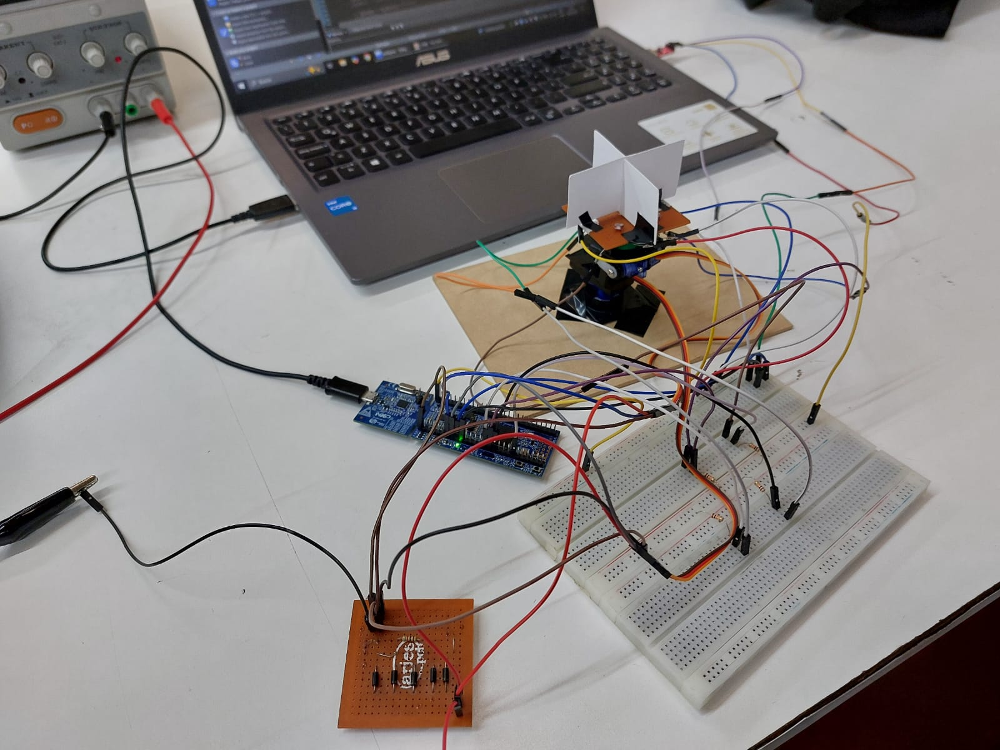

# Seguidor Luminico 
> **Asignatura:** Electrónica Digital [III] - Universidad Nacional de Córdoba
> **Integrantes:** 
> * Gutierrez, Patricio
> * Zambellini, Matías Manuel

> * **Profesor:** Marcos Blasco

---

## 🚀 1. Descripción General del Proyecto

El proyecto consiste en un seguidor luminico automatizado de dos ejes, diseñado para apuntar una estructura hacia la fuente de mayor intensidad lumínica. Para esto se utilizan 4 LDR (matriz de fotorresistencias) divididas por una superficie opaca que genera sombras diferenciales sobre los mismos; así, calculamos el error de posición en ambos ejes y lo corregimos mediante el uso de dos servomotores. A su vez, el sistema dispone de un sistema de alarma acústica y una interfaz de telemetría bidireccional vía consola.


### 🎯 Alcances del Proyecto (¿Qué hace y qué NO hace el sistema?)

* **El sistema SÍ es capaz de:** Adquirir lecturas analógicas de cuatro sensores LDR en tiempo real, controlar dinámicamente la posición de dos servomotores mediante señales PWM, generar alertas sonoras controladas por hardware y transmitir/recibir telemetría y comandos de control a través de un puerto serie (UART).
* **El sistema NO incluye (Fuera de alcance):** Movimientos mecánicos superiores a 180° en los ejes de actuación, almacenamiento local de datos ni conectividad inalámbrica.

### ⏩ Posibles Etapas Siguientes (Líneas Futuras)

* Migrar el circuito de montaje híbrido (protoboard/placa universal) a un circuito impreso (PCB) diseñado bajo normas establecidas (IEEE).
* Reemplazar los servomotores por motores paso a paso de grado industrial o actuadores lineales para soportar cargas estructurales reales (ej. paneles solares).
* Diseñar una interfaz gráfica (GUI) o un Dashboard web para la recolección de datos de telemetría, monitoreo de temperatura de motores y control remoto del sistema.

---

## 📐 2. Arquitectura del Sistema: Hardware y Software

### 🔌 Hardware & Interconexión

* **Esquemático del Circuito:** 


* **Descripción del Circuito y Consideraciones de Diseño:** El hardware consta de una etapa lógica centralizada en la MCU LPC1769 (operando a 3.3V) y una etapa de potencia independiente (5V). La lectura de luz se realiza mediante un puente divisor resistivo para adaptar la impedancia de los LDR al ADC. Para el accionamiento de la alarma, se implementó una etapa de potencia mediante un MOSFET 2N7000 (Canal N) actuando como interruptor para manejar la corriente requerida por el buzzer pasivo sin sobrecargar los pines de salida de la MCU. El montaje final es híbrido, combinando protoboard para la lógica temporal y soldadura directa para las pistas de mayor consumo.

### 💻 Arquitectura de Software (Firmware)

* **Estrategia General:** El sistema se basa en una arquitectura Bare-Metal con un lazo principal (Super-loop) asistido por interrupciones asincrónicas. Se evita el uso de instrucciones bloqueantes en el flujo principal mediante el uso de "flags" (banderas de estado).

## ⚡ 3. Especificaciones Eléctricas, Alimentación y Entorno

### 🔌 Parámetros de Alimentación y Consumo

* **Tensión de operación del sistema:** 5V DC (Etapa de Potencia: Servos y Buzzer) / 3.3V DC (Etapa Lógica: LPC1769 y sensores LDR).
* **Método de alimentación:** Alimentación dual mediante bus USB y fuente de tensión continua externa regulada.
* **Consumo estimado o medido:** * En modo activo (máxima carga, servos en movimiento): ~300 mA a 450 mA.
* En modo reposo (servos en posición fija manteniendo torque, midiendo sensores): ~70 mA a 100 mA.

* **IDE y SDK:**  MCUXpresso IDE v25.6.136.
* **Microcontrolador Principal:**  NXP LPC1769.
* **Bibliotecas de Terceros y Versiones:** Drivers nativos CMSIS provistos por la cátedra.
* **Periféricos Avanzados Utilizados:** NVIC, GPDMA, SysTick, DAC, TIMERS (Match/PWM), UART y ADC.
* **Estrategia de Concurrencia:** Arquitectura Bare-metal con máquina de estados cooperativa basada en flags. Las tareas críticas periódicas (muestreo del ADC) son agendadas por la interrupción de temporización del SysTick_Handler, mientras que los eventos externos (recepción de caracteres de comando) son atendidos de forma asíncrona mediante la interrupción UART3_IRQHandler por Rx Data Available (RDA). El procesador evalúa estas banderas en el loop principal para derivar la ejecución.

---

## 🔄 4. Proceso de Integración y Desarrollo

El proyecto se desarrolló bajo un enfoque de ingeniería modular, separando subsistemas antes de la integración total:
* **Etapa 1 (Validación inicial):** Verificación del funcionamiento de los servomotores y caracterización analógica de los 4 sensores LDR de forma aislada.
* **Etapa 2 (Adquisición/Comunicación):** Configuración de registros de periféricos (ADC, Timers para PWM, UART). Implementación de la adquisición de datos y envío de telemetría por consola.
* **Etapa 3 (Integración lógica):** Desarrollo del algoritmo de control. Implementación del cálculo de error diferencial entre sectores y creación de la "Deadzone" para evitar oscilaciones innecesarias de los motores.
* **Etapa 4 (Sistema Completo):** Soldadura final de cableados, sintonización de pasos de movimiento de los servos y pruebas de estrés lumínico. En esta etapa se desarrolló y validó el módulo independiente de transferencia de memoria directa (GPDMA a DAC).

---

## 📊 5. Ensayos, Pruebas y Resultados

 El sistema demostró un comportamiento estable y una alta velocidad de respuesta al estímulo lumínico diferencial.

* **Aislamiento de ejes:** Se estimuló lumínicamente la matriz bloqueando sectores específicos para corroborar que el algoritmo no acople matemáticamente el eje Pan con el Tilt.
 * **Ensayo general:** Se utilizó una linterna en un ambiente con iluminación no tan alta para medir los voltajes resultantes con multímetro y verificar el rastreo dinámico completo.
 * **Ensayo de Validación DMA/DAC:** Para garantizar la estabilidad del lazo principal de los servomotores sin bloqueos de bus de memoria, la generación de ondas acústicas fue aislada. Se creó el archivo DAC_DMA.c, un firmware de prueba dedicado que demuestra el correcto funcionamiento del GPDMA inyectando un arreglo de datos (Look-up Table) en el DAC a 1 KHz, generando una onda senoidal pura verificada por instrumental.

Para hacer que el DAC y DMA funcionen correctamente se realizo la experiencia por separado, haciendo uso de un osciloscopio para ver que la señal sea la correcta.

* **Funcionamiento General:** 
* **Montaje del Hardware:** 
* **Validación GPDMA/DAC:**  y 

---

## 📂 6. Estructura del Repositorio

```text
├── firmware/          # Código fuente del proyecto       
│   ├── inc            # Archivos de cabecera (.h)
│   ├── src            # Archivos de código (.c)
├── hardware/          # Archivos de diseño (KiCad/Altium), esquemáticos en PDF/Imagen y BOM
├── docs/              # Datasheets clave, imágenes del README, notas de aplicación
└── README.md          # Este archivo de presentación